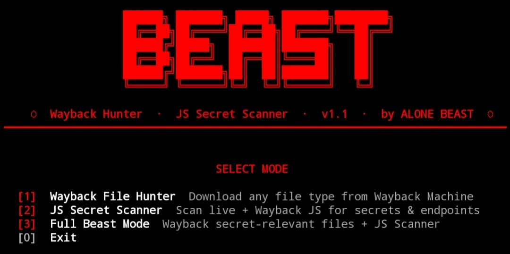

# beastcrypt

<p align="center">
  
</p>


> Wayback Machine file hunter + JS secret scanner — by **ALONE BEAST**

[](https://python.org)
[](LICENSE)
[]()

---

## Quick Install

```bash
curl -s https://raw.githubusercontent.com/alonebeast002/beastcrypt/main/setup.sh | bash
```

Then just run:

```bash
beastcrypt
```

---

## Modes

| Mode | Name | Description |
|------|------|-------------|
| `1` | Wayback File Hunter | Download any file type from Wayback Machine |
| `2` | JS Secret Scanner | Scan JS files for API keys, tokens & endpoints |
| `3` | Full Beast Mode | Mode 1 + Mode 2 combined |

---

## CLI Usage

```bash
beastcrypt -d example.com -m 1 -t js,json,pdf
beastcrypt -d example.com -m 2
beastcrypt -d example.com -m 3 -o ./output
```

**Flags:**

| Flag | Description |
|------|-------------|
| `-d` | Target domain |
| `-m` | Mode (1, 2, or 3) |
| `-t` | File types: `js,json,pdf,zip,xml,sql,config,img,all` |
| `-o` | Output directory (default: `beast_output`) |
| `--json-only` | Save URL report only, skip downloads |

---

## What It Detects

AWS keys · Google API keys · GitHub tokens · Stripe keys · JWT tokens · Database URLs · S3 buckets · Telegram bots · Cloudinary · SendGrid · Slack tokens · and more.

---

## Output

```
beast_output/
├── wayback_example_com/
│   ├── downloaded files...
│   └── wayback_report.json
└── jsreaper_example_com/
    ├── js_urls.txt
    ├── map_urls.txt
    └── secrets_example_com.json
```

---

## Requirements

`curl` · `python3` · `katana` *(optional — for live JS crawl)*

---

> **For educational & authorized testing only. Use responsibly.**
